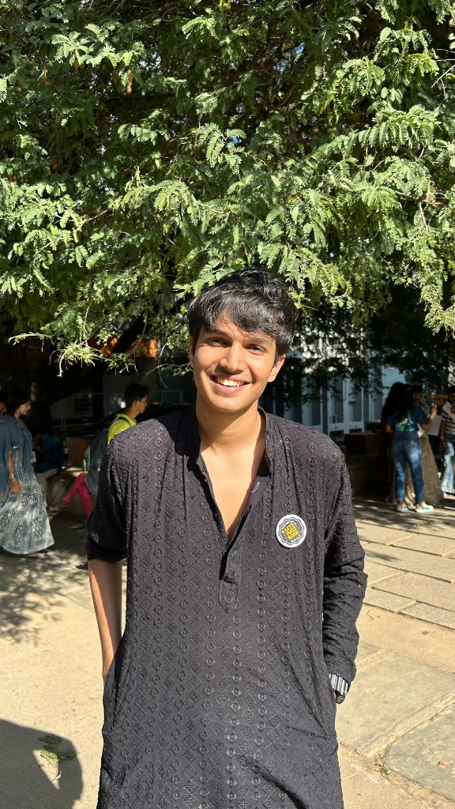

# 🖥️ Ujjwal Bajpai's Portfolio (macOS Style)



> A fully functional, interactive macOS simulation running in your browser, designed to showcase my skills, projects, and professional journey.

## 👋 About Me

I am **Ujjwal Bajpai**, an Electronics & Communication Engineering student at **RV College of Engineering**, passionate about **Full-Stack Development** and **AI-driven solutions**. 

This portfolio is a creative representation of my work, featuring a functional Terminal, Dock, Launchpad, and window management system—all built with web technologies.

*   **Location:** Bangalore, India
*   **Email:** [bajpaiujjwal3@gmail.com](mailto:bajpaiujjwal3@gmail.com)
*   **LinkedIn:** [Ujjwal Bajpai](https://www.linkedin.com/in/ujjwal-bajpai-9aa242289/)
*   **LeetCode:** [Top 10% (425+ Solved)](https://leetcode.com/u/ujjwalbajpai/)

## 🚀 Featured Projects

Explore these apps within the portfolio (via Launchpad or Finder):

*   **📹 Yoom**: A modern video conferencing app (Zoom clone) built with Next.js and GetStream.
*   **🚦 FlowGuard AI**: Intelligent traffic management system for Bangalore using ML & customized signal control.
*   **🩺 CodRev**: AI-powered code review platform leveraging Google Gemini's API.
*   **🧠 DocuMind**: Document analysis tool that lets you "chat" with your PDFs.

## 🛠️ Tech Stack

This project is built using:

*   **Framework:** React (+ Vite)
*   **State Management:** Zustand, Redux
*   **Languages:** TypeScript, SCSS/CSS
*   **Component Libraries:** UnoCSS, Radix UI (simulated)
*   **Utilities:** date-fns, framer-motion

## 💻 Features

*   **Desktop Environment**: Draggable windows, context menus, and multitasking.
*   **Terminal**: A working ZSH-like terminal with custom commands (try `cat bio.txt` or `ls`).
*   **Safari**: A browser simulation to view my external profiles (GitHub, LeetCode, Codeforces).
*   **Customization**: Dynamic wallpapers and themes (Light/Dark mode).
*   **Responsive**: Works on various screen sizes (best viewed on Desktop).

## 🏃‍♂️ Running Locally

1.  **Clone the repository**
    ```bash
    git clone https://github.com/Ujjwal120605/macos_portfolio.git
    cd macos_portfolio
    ```

2.  **Install dependencies**
    ```bash
    npm install
    # or
    pnpm install
    ```

3.  **Start the development server**
    ```bash
    npm run dev
    ```

4.  Open [http://localhost:5173](http://localhost:5173) in your browser.

## 📄 License

This project is open source and available under the [MIT License](LICENSE).

---
*Based on the amazing work by [Renovamen](https://github.com/Renovamen/playground-macos).*
